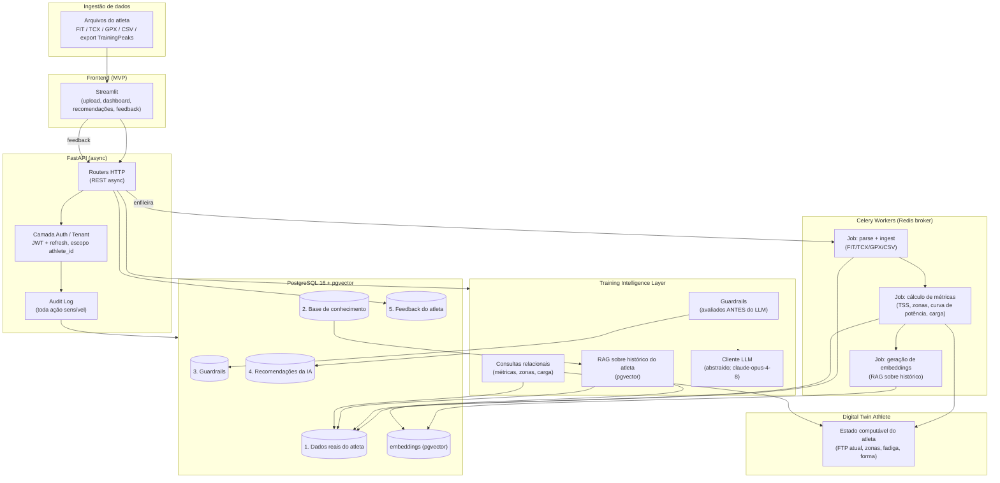
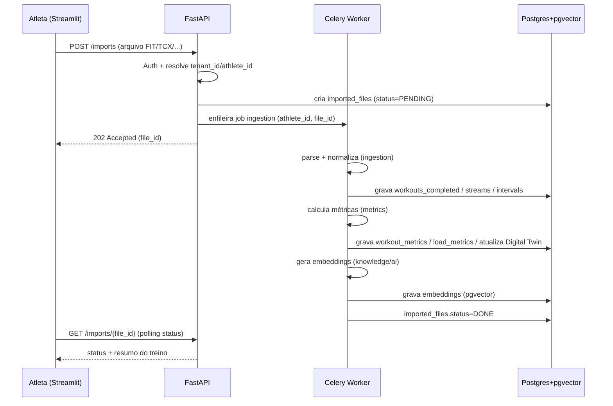
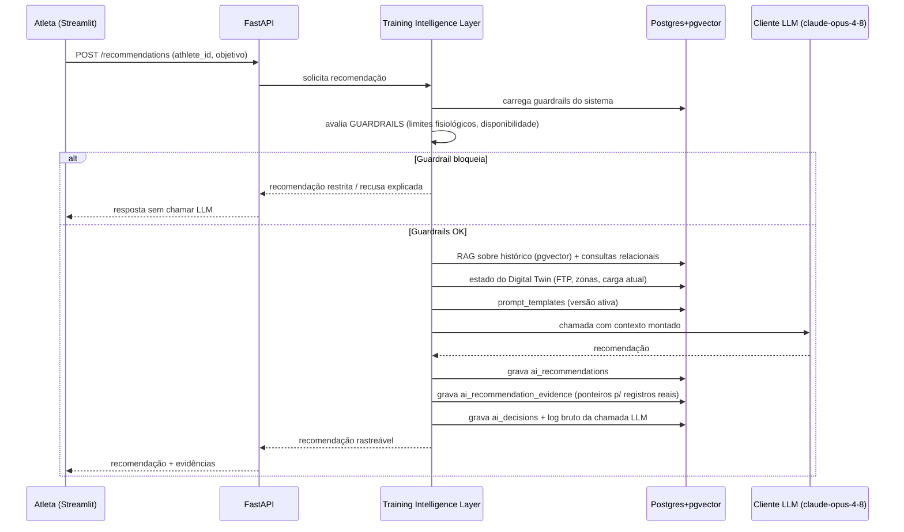
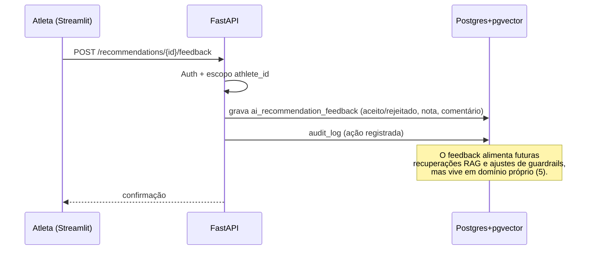
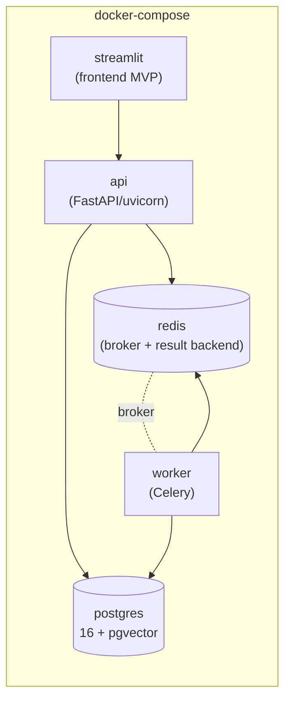

# Arquitetura — Athlete AI Training Hub

> Sistema de gestão de treinamento de endurance (ciclismo / MTB) orientado por IA.
> Documento de arquitetura da Fase 0 (validação com 2 atletas reais por 4 semanas).

---

## 1. Visão geral da arquitetura

O **Athlete AI Training Hub** é uma plataforma que centraliza todo o histórico de treino de um atleta (o *Athlete Data Hub*), constrói uma representação computável desse atleta (o *Digital Twin Athlete*) e produz recomendações de treino **explicáveis e rastreáveis** por meio de uma camada de inteligência (*Training Intelligence Layer*) que combina consultas relacionais, RAG sobre o histórico do próprio atleta e uma base de conhecimento geral de treinamento.

Princípios estruturais que governam todo o desenho:

- **Fonte única da verdade.** Os dados reais do atleta (arquivos importados, métricas, zonas, provas) vivem em um único modelo relacional. Nenhuma recomendação inventa dados — ela referencia evidências existentes.
- **Separação estrita de 5 domínios de dados** (ver seção 6): (1) dados reais do atleta, (2) base de conhecimento geral de treinamento, (3) guardrails do sistema, (4) recomendações da IA e (5) feedback do atleta. Esses domínios nunca são misturados na mesma tabela nem no mesmo prompt sem fronteira explícita.
- **Multi-tenant desde o dia zero.** Todo atleta tem `tenant_id`; tabelas com escopo de atleta carregam `athlete_id`; soft delete (`deleted_at`) em toda parte; papéis `ADMIN` / `ATHLETE` / `COACH` (futuro); autenticação por JWT + refresh token.
- **Explicabilidade e rastreabilidade.** Toda recomendação registra: o prompt versionado usado, as evidências consultadas (com ponteiros para os registros reais), e o log completo da chamada ao LLM. Nada é uma "caixa preta".
- **Guardrails antes do LLM.** Restrições de segurança fisiológica e de negócio são avaliadas *antes* de qualquer chamada ao modelo. O LLM nunca é a única barreira.

A stack tecnológica da Fase 0:

| Camada | Tecnologia |
|---|---|
| Backend / API | Python 3.12, FastAPI (async), Pydantic v2 |
| ORM / Migrações | SQLAlchemy 2.x (async), Alembic |
| Banco de dados | PostgreSQL 16 + extensão **pgvector** |
| Jobs assíncronos | Celery + Redis |
| RAG | Implementação própria sobre pgvector (sem LangChain) |
| LLM | Cliente abstraído por provedor; padrão **Anthropic `claude-opus-4-8`** |
| Frontend (MVP) | Streamlit |

---

## 2. Diagrama de arquitetura

---

## 3. Responsabilidades dos componentes

A organização do código segue módulos de serviço com responsabilidade única. Cada módulo expõe uma fronteira clara e não vaza detalhes de outro domínio.

### `ingestion`
- Recebe e valida arquivos brutos (`FIT`, `TCX`, `GPX`, `CSV`, export do TrainingPeaks).
- Faz o *parsing* específico de cada formato e normaliza para o modelo interno (`workouts_completed`, `workout_streams`, `workout_intervals`).
- Registra cada arquivo em `imported_files` com checksum, status e origem (`data_sources`).
- Idempotência: o mesmo arquivo importado duas vezes não duplica treinos (deduplicação por checksum + timestamp).
- Não calcula métricas nem gera embeddings — apenas persiste os dados crus normalizados e dispara os jobs seguintes.

### `metrics`
- Calcula métricas derivadas a partir dos dados crus: TSS, IF, NP, curva de potência (`power_curve`), zonas de potência/FC, métricas de carga (CTL/ATL/TSB em `load_metrics`).
- Mantém o histórico versionado de FTP (`ftp_history`) e zonas (`power_zones`, `heart_rate_zones`) com intervalos de validade (ver seção 5 do `data_model.md`).
- Alimenta o **Digital Twin** com o estado fisiológico atual do atleta.
- É puramente determinístico — nenhuma chamada a LLM.

### `ai`
- Orquestra a **Training Intelligence Layer**: aplica guardrails, monta o contexto (RAG + consultas relacionais + Digital Twin), chama o cliente LLM e persiste a recomendação com evidências.
- Garante a sequência **guardrails → contexto → LLM → persistência rastreável**.
- Registra prompt versionado (`prompt_templates`), evidências (`ai_recommendation_evidence`), decisões (`ai_decisions`) e o log bruto da chamada ao LLM.
- Usa o cliente abstraído por provedor — trocar o provedor não toca o restante da camada.

### `knowledge`
- Gerencia a base de conhecimento geral de treinamento (`knowledge_documents`) e seus embeddings (`embeddings`).
- Expõe busca semântica sobre o conhecimento *global* (não específico de atleta).
- Mantém a separação rígida: conhecimento geral **nunca** é gravado em tabelas com escopo de atleta.

### `repositories`
- Camada de acesso a dados (SQLAlchemy 2.x async). Toda query passa por aqui.
- **Repository base** que injeta automaticamente o filtro `athlete_id` (e exclui `deleted_at IS NOT NULL`) em todas as operações de tabelas com escopo de atleta — é o ponto central de aplicação do isolamento multi-tenant (ver seção 5).
- Repositórios de tabelas globais (base de conhecimento, `system_config`) não aplicam filtro de atleta, por contrato explícito.

### `jobs`
- Define as tasks Celery e a orquestração entre elas (ingest → métricas → embeddings).
- Lida com retries, dead-letter e idempotência dos jobs assíncronos.
- Reporta status de processamento de volta para `imported_files`, consultável pelo frontend.

---

## 4. Fluxos de dados

### (a) Importação de um arquivo

### (b) Geração de uma recomendação (guardrails antes do LLM)

O ponto-chave: **os guardrails são avaliados antes de qualquer token enviado ao LLM**. Eles podem podar o espaço de resposta (restringir a recomendação) ou bloqueá-la inteiramente, sem custo de chamada ao modelo.

### (c) Loop de feedback

O feedback do atleta é um domínio separado (5). Ele **não** sobrescreve os dados reais (1) nem a recomendação original (4) — é registrado de forma aditiva e auditável, e pode ser usado como sinal em recuperações futuras.

---

## 5. Estratégia de isolamento multi-tenant

O isolamento é aplicado em **camadas defensivas**, não apenas no banco:

1. **Camada de autenticação/tenant (API).** Todo request autenticado resolve `tenant_id` e `athlete_id` a partir do JWT. O contexto da requisição carrega esses valores; nenhuma rota aceita `athlete_id` arbitrário do corpo sem validação contra o token.

2. **Repository base (aplicação a nível de serviço).** Todo repositório de tabela com escopo de atleta herda de uma classe base que:
   - injeta `WHERE athlete_id = :current_athlete_id` automaticamente em leituras;
   - preenche `athlete_id` e `tenant_id` automaticamente em escritas;
   - aplica `WHERE deleted_at IS NULL` por padrão (soft delete);
   - rejeita operações cross-tenant em tempo de execução.

   Esse é o ponto central de aplicação — o isolamento não depende de cada desenvolvedor lembrar de filtrar manualmente.

3. **Soft delete universal.** Nenhum registro é apagado fisicamente na Fase 0. `deleted_at` marca exclusão lógica e o repository base o respeita, preservando trilha de auditoria e reversibilidade.

4. **Audit logging.** Toda ação sensível (importação, recomendação, feedback, mudança de config) grava em `audit_logs` com `tenant_id`, `athlete_id`, `created_by`, ação e payload relevante. Permite reconstruir *quem fez o quê e quando*.

> Para a Fase 0 (2 atletas), o isolamento é a nível de aplicação (filtro por `athlete_id` no repository base). Caso a base cresça, esse mesmo modelo permite ativar **Row-Level Security (RLS)** no Postgres como segunda barreira sem reescrever o domínio.

---

## 6. Separação dos 5 domínios de dados

A separação é estrutural — domínios diferentes ocupam grupos de tabelas distintos e nunca compartilham linhas:

| # | Domínio | Escopo | Tabelas (principais) | Regra |
|---|---|---|---|---|
| 1 | **Dados reais do atleta** | tenant (`athlete_id`) | `athletes`, `workouts_*`, `ftp_history`, `*_zones`, `body_metrics`, `races`, `load_metrics` | Fonte única da verdade. Imutável exceto por nova importação. |
| 2 | **Base de conhecimento geral** | global | `knowledge_documents`, `embeddings` (globais) | Conhecimento de treinamento, sem PII de atleta. Compartilhado entre tenants. |
| 3 | **Guardrails do sistema** | global / config | `system_config`, regras de guardrail | Restrições fisiológicas e de negócio. Avaliadas antes do LLM. |
| 4 | **Recomendações da IA** | tenant (`athlete_id`) | `ai_recommendations`, `ai_recommendation_evidence`, `ai_decisions` | Saída da IA, sempre rastreável às evidências do domínio 1. |
| 5 | **Feedback do atleta** | tenant (`athlete_id`) | `ai_recommendation_feedback` | Aditivo e auditável. Não sobrescreve 1 nem 4. |

A montagem de prompt na Training Intelligence Layer mantém esses domínios em blocos de contexto **rotulados e separados**: dado real, conhecimento geral, guardrails e feedback nunca se confundem dentro do prompt enviado ao LLM. Isso é parte da rastreabilidade — a evidência de cada afirmação aponta para o domínio correto.

---

## 7. Topologia de deploy (MVP)

A Fase 0 roda inteiramente via `docker-compose`, em uma única máquina:

Serviços do `docker-compose`:

- **`api`** — FastAPI servido por uvicorn; expõe a API REST async e a camada de auth/tenant.
- **`worker`** — Celery; consome jobs de ingestão, métricas e embeddings.
- **`postgres`** — PostgreSQL 16 com a extensão `pgvector` habilitada; volume persistente.
- **`redis`** — broker e result backend do Celery.
- **`streamlit`** — frontend de validação; consome a API.

**Deploy futuro (cloud).** O mesmo desenho de serviços mapeia diretamente para um ambiente gerenciado: `api` e `streamlit` em contêineres (ECS/Cloud Run/Kubernetes), `worker` em pool dedicado, Postgres+pgvector gerenciado (RDS/Cloud SQL com pgvector), Redis gerenciado (ElastiCache/Memorystore), e segredos em um secrets manager. Nenhuma reescrita de domínio é necessária — apenas configuração e orquestração.

---

## 8. Justificativa das decisões técnicas

### Streamlit (MVP) em vez de Next.js
A Fase 0 valida **hipóteses de produto com 2 atletas por 4 semanas**, não a experiência de UI final. Streamlit entrega dashboards, upload de arquivos, visualização de recomendações e captura de feedback com uma fração do esforço de um frontend SPA. Construir um Next.js agora otimizaria uma camada que ainda pode ser totalmente descartada se a validação falhar. A API REST async já existe independentemente do frontend, então a migração para Next.js (ou outro) depois da validação é direta — o backend não muda.

### RAG próprio sobre pgvector em vez de LangChain
O RAG aqui não é "buscar e colar contexto" — ele precisa preservar três propriedades que LangChain abstrai e dificulta auditar:
- **Versionamento de prompt** (`prompt_templates`): saber exatamente qual prompt gerou qual recomendação.
- **Rastreabilidade de evidências** (`ai_recommendation_evidence`): cada afirmação aponta para o registro real que a sustenta.
- **Log de chamada ao LLM**: o payload bruto enviado e recebido, para auditoria e reprodutibilidade.

Uma implementação própria sobre pgvector (embeddings + busca por similaridade no mesmo Postgres dos dados relacionais) mantém o controle total dessas três propriedades, evita uma dependência pesada de abstração e elimina a divergência entre a fonte de embeddings e a fonte de dados relacionais.

### PostgreSQL + pgvector (sem TimescaleDB no MVP)
Os dados de séries temporais de alta frequência (streams de potência/FC segundo a segundo) **são volumosos**, mas no MVP eles são:
- gravados uma vez na ingestão e lidos em blocos (não há ingestão contínua em streaming);
- consultados majoritariamente por treino/intervalo, não por agregações temporais massivas cross-atleta.

Com apenas 2 atletas por 4 semanas, o volume não justifica a complexidade operacional do TimescaleDB (hypertables, políticas de retenção, chunks). Usar **um único Postgres 16 + pgvector** mantém dados relacionais, séries temporais e embeddings no mesmo banco — simplificando transações, joins e o RAG.

**Caminho de migração para TimescaleDB.** O desenho deixa a porta aberta:
- `workout_streams` é desenhada como uma tabela de série temporal candidata a *hypertable* (chave por `athlete_id` + timestamp).
- Quando o volume justificar (muitos atletas, retenção longa, agregações contínuas), habilita-se a extensão TimescaleDB e converte-se `workout_streams` (e eventualmente `load_metrics`) em hypertables, adicionando políticas de retenção/compressão — sem mudar o modelo de domínio nem a camada de repositórios. pgvector e TimescaleDB coexistem no mesmo Postgres, então o RAG permanece intacto.
