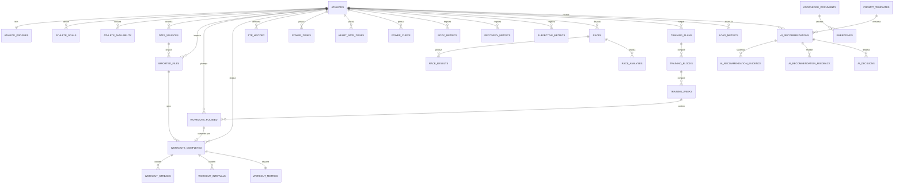

# Modelo de Dados — Athlete AI Training Hub

> Modelo relacional da Fase 0. PostgreSQL 16 + pgvector. SQLAlchemy 2.x async + Alembic.

---

## Convenções comuns

Todas as tabelas seguem o mesmo contrato base:

| Coluna | Tipo | Descrição |
|---|---|---|
| `id` | `UUID` (PK) | Identificador único (UUID v4). |
| `created_at` | `timestamptz` | Criação do registro. |
| `updated_at` | `timestamptz` | Última atualização. |
| `deleted_at` | `timestamptz` (nullable) | **Soft delete** — `NULL` = ativo. Aplicado em toda parte. |
| `created_by` | `UUID` (nullable) | Quem criou (usuário/atleta/sistema). |
| `athlete_id` | `UUID` (FK) | Presente apenas em tabelas **com escopo de atleta** (tenant-isolated). |

- **Tabelas com escopo de atleta** (tenant-isolated) carregam `athlete_id` e são filtradas automaticamente pelo *repository base* (ver `architecture.md`, seção 5). Todo `athlete` pertence a um `tenant_id`.
- **Tabelas globais** (base de conhecimento, configuração do sistema) **não** carregam `athlete_id` e são compartilhadas entre tenants.

Legenda nas seções: 🔒 = escopo de atleta (tenant-isolated) · 🌐 = global.

---

## Diagrama ER (entidades centrais)

---

## Grupo 1 — Atleta e perfil 🔒

| Tabela | Propósito | Colunas-chave |
|---|---|---|
| `athletes` | Raiz do tenant. Um atleta = um inquilino. | `tenant_id`, `email`, `role` (ADMIN/ATHLETE/COACH), `display_name`, `status` |
| `athlete_profiles` | Dados biométricos e contextuais estáveis do atleta (1:1). | `athlete_id`, `birth_date`, `sex`, `height_cm`, `discipline` (road/MTB), `experience_level` |
| `athlete_goals` | Objetivos do atleta (evento-alvo, metas de FTP, etc). | `athlete_id`, `goal_type`, `target_value`, `target_date`, `priority`, `status` |
| `athlete_availability` | Disponibilidade semanal de treino (insumo dos guardrails). | `athlete_id`, `weekday`, `available_minutes`, `preferred_time`, `valid_from`, `valid_to` |

---

## Grupo 2 — Fontes e importação 🔒

| Tabela | Propósito | Colunas-chave |
|---|---|---|
| `data_sources` | Origens de dados conectadas (upload manual, export TP, etc). | `athlete_id`, `source_type` (FIT/TCX/GPX/CSV/TP_EXPORT), `name`, `config` (JSONB) |
| `imported_files` | Cada arquivo bruto importado, com status de processamento. | `athlete_id`, `data_source_id`, `filename`, `format`, `checksum`, `status` (PENDING/DONE/FAILED), `error` |

`checksum` garante idempotência: o mesmo arquivo não é reprocessado em duplicidade.

---

## Grupo 3 — Treinos e séries temporais 🔒

| Tabela | Propósito | Colunas-chave |
|---|---|---|
| `workouts_planned` | Treino planejado (estrutura prescrita). | `athlete_id`, `training_week_id`, `date`, `type`, `planned_tss`, `planned_duration_s`, `structure` (JSONB) |
| `workouts_completed` | Treino realizado, derivado de um arquivo importado. | `athlete_id`, `imported_file_id`, `planned_id` (nullable), `started_at`, `duration_s`, `distance_m`, `sport` |
| `workout_streams` | **Série temporal** segundo a segundo (potência, FC, cadência, GPS). Candidata a hypertable. | `athlete_id`, `workout_id`, `t_offset_s`, `power_w`, `hr_bpm`, `cadence_rpm`, `lat`, `lon`, `altitude_m` |
| `workout_intervals` | Intervalos/laps de um treino. | `athlete_id`, `workout_id`, `index`, `start_s`, `duration_s`, `avg_power_w`, `avg_hr_bpm`, `np_w` |
| `workout_metrics` | Métricas resumo por treino (1:1 com completed). | `athlete_id`, `workout_id`, `tss`, `if`, `np_w`, `avg_power_w`, `avg_hr_bpm`, `work_kj` |

`workout_streams` é a tabela mais volumosa e foi desenhada com chave `athlete_id` + `t_offset_s`/timestamp para conversão futura em *hypertable* TimescaleDB (ver caminho de migração em `architecture.md`, seção 8).

---

## Grupo 4 — Fisiologia, FTP e zonas (versionados) 🔒

| Tabela | Propósito | Colunas-chave |
|---|---|---|
| `ftp_history` | Histórico de FTP com intervalo de validade. | `athlete_id`, `ftp_w`, `source` (test/estimate), `valid_from`, `valid_to`, `is_current` |
| `power_zones` | Conjunto de zonas de potência vigente em um período. | `athlete_id`, `ftp_history_id`, `zone_number`, `name`, `min_w`, `max_w`, `valid_from`, `valid_to` |
| `heart_rate_zones` | Conjunto de zonas de FC vigente em um período. | `athlete_id`, `zone_number`, `name`, `min_bpm`, `max_bpm`, `valid_from`, `valid_to` |
| `power_curve` | Melhor potência por duração (mean-maximal power). | `athlete_id`, `duration_s`, `best_power_w`, `computed_at`, `window_from`, `window_to` |

### Abordagem de versionamento de FTP e zonas (intervalos de validade)

FTP e zonas **mudam ao longo do tempo** e cada treino deve ser interpretado pelas zonas **vigentes na data do treino**, não pelas zonas atuais. Por isso o modelo usa *validade por intervalo de datas*:

- Cada registro de `ftp_history`, `power_zones` e `heart_rate_zones` carrega `valid_from` e `valid_to` (`NULL` em `valid_to` = vigente até o presente).
- Ao registrar um novo FTP, o registro anterior tem seu `valid_to` fechado na data do novo, e o novo abre com `valid_from` nessa data e `valid_to = NULL`.
- `ftp_history.is_current` é um atalho indexado para o registro vigente (deve haver no máximo um por atleta).
- Consultar "qual era a zona Z2 deste atleta em 2026-03-10" é uma busca por `valid_from <= data < valid_to` — sem perder o histórico nem reescrever registros passados.

Isso preserva a fonte da verdade: o FTP de ontem continua sendo o FTP de ontem.

---

## Grupo 5 — Métricas corporais e subjetivas 🔒

| Tabela | Propósito | Colunas-chave |
|---|---|---|
| `body_metrics` | Métricas corporais ao longo do tempo (peso, %gordura). | `athlete_id`, `date`, `weight_kg`, `body_fat_pct`, `resting_hr_bpm` |
| `recovery_metrics` | Métricas de recuperação (HRV, sono, prontidão). | `athlete_id`, `date`, `hrv_ms`, `sleep_hours`, `readiness_score` |
| `subjective_metrics` | Percepção subjetiva do atleta (RPE, fadiga, humor). | `athlete_id`, `date`, `rpe`, `fatigue`, `mood`, `notes` |

---

## Grupo 6 — Provas e análises 🔒

| Tabela | Propósito | Colunas-chave |
|---|---|---|
| `races` | Eventos/provas (alvo ou disputadas). | `athlete_id`, `name`, `date`, `discipline`, `distance_m`, `priority` (A/B/C), `goal_id` (nullable) |
| `race_results` | Resultado obtido em uma prova. | `athlete_id`, `race_id`, `position`, `time_s`, `avg_power_w`, `np_w`, `category` |
| `race_analyses` | Análise pós-prova (insumo qualitativo para RAG). | `athlete_id`, `race_id`, `summary`, `strengths`, `weaknesses`, `created_by` |

---

## Grupo 7 — Planos de treino 🔒

| Tabela | Propósito | Colunas-chave |
|---|---|---|
| `training_plans` | Plano macro do atleta (periodização). | `athlete_id`, `name`, `start_date`, `end_date`, `goal_id`, `status` |
| `training_blocks` | Bloco/mesociclo dentro de um plano. | `athlete_id`, `training_plan_id`, `index`, `focus`, `start_date`, `end_date` |
| `training_weeks` | Semana/microciclo dentro de um bloco. | `athlete_id`, `training_block_id`, `week_number`, `start_date`, `planned_tss` |

`workouts_planned` (Grupo 3) referencia `training_week_id`, fechando a hierarquia plano → bloco → semana → treino.

---

## Grupo 8 — Carga de treino 🔒

| Tabela | Propósito | Colunas-chave |
|---|---|---|
| `load_metrics` | Métricas diárias de carga (CTL/ATL/TSB). Série temporal por dia. | `athlete_id`, `date`, `ctl` (fitness), `atl` (fatigue), `tsb` (form), `ramp_rate`, `daily_tss` |

Alimenta o estado de fadiga/forma do **Digital Twin**. Candidata secundária a hypertable TimescaleDB no futuro.

---

## Grupo 9 — Recomendações da IA e feedback 🔒

| Tabela | Propósito | Colunas-chave |
|---|---|---|
| `ai_recommendations` | Recomendação produzida pela Training Intelligence Layer. | `athlete_id`, `prompt_template_id`, `type`, `content`, `model` (`claude-opus-4-8`), `status`, `created_by` |
| `ai_recommendation_evidence` | Evidências que sustentam a recomendação (ponteiros para registros reais). | `athlete_id`, `recommendation_id`, `source_table`, `source_id`, `relevance_score`, `snippet` |
| `ai_recommendation_feedback` | **Domínio 5** — feedback do atleta sobre a recomendação. | `athlete_id`, `recommendation_id`, `accepted` (bool), `rating`, `comment` |
| `ai_decisions` | Trilha de decisão/raciocínio + log bruto da chamada ao LLM. | `athlete_id`, `recommendation_id`, `step`, `guardrails_applied` (JSONB), `llm_request` (JSONB), `llm_response` (JSONB), `tokens` |

`ai_recommendation_evidence` é o coração da **rastreabilidade**: cada afirmação da IA aponta para `(source_table, source_id)` de um registro real do domínio 1. `ai_decisions` guarda o registro de auditoria completo da chamada (prompt, resposta, tokens, guardrails aplicados).

---

## Grupo 10 — Base de conhecimento e prompts 🌐 / 🔒

| Tabela | Escopo | Propósito | Colunas-chave |
|---|---|---|---|
| `knowledge_documents` | 🌐 global | **Domínio 2** — conhecimento geral de treinamento (sem PII). | `title`, `source`, `body`, `tags`, `version` |
| `embeddings` | 🌐 / 🔒 | Vetores pgvector para RAG. Globais (conhecimento) ou de atleta (histórico). | `owner_type` (KNOWLEDGE/ATHLETE), `owner_id`, `athlete_id` (nullable), `chunk_text`, `embedding` (`vector`), `model` |
| `prompt_templates` | 🌐 global | Versionamento de prompts da IA (insumo da explicabilidade). | `name`, `version`, `template`, `is_active`, `created_by` |

`embeddings` é a tabela que cruza os domínios via pgvector, mas mantém a fronteira: quando `owner_type = ATHLETE`, `athlete_id` é obrigatório e o registro é tenant-isolated; quando `owner_type = KNOWLEDGE`, `athlete_id` é `NULL` e o vetor é global. A busca por similaridade nunca mistura conhecimento geral com histórico de atleta sem rótulo explícito de origem.

`prompt_templates` garante que toda `ai_recommendation` referencie a **versão exata** do prompt que a gerou.

---

## Grupo 11 — Auditoria e configuração 🌐 / 🔒

| Tabela | Escopo | Propósito | Colunas-chave |
|---|---|---|---|
| `audit_logs` | 🔒 (com `tenant_id`) | **Trilha de auditoria** de toda ação sensível. | `tenant_id`, `athlete_id`, `actor_id`, `action`, `entity_table`, `entity_id`, `payload` (JSONB), `created_at` |
| `system_config` | 🌐 global | **Domínio 3** — configuração do sistema e regras de guardrail. | `key`, `value` (JSONB), `description`, `is_active` |

`audit_logs` carrega `tenant_id`/`athlete_id` para rastrear quem fez o quê dentro de cada tenant. `system_config` é global e hospeda os parâmetros dos guardrails avaliados **antes** do LLM (limites fisiológicos, ramp rate máximo, regras de disponibilidade).

---

## Mapa de domínios → grupos de tabelas

| Domínio (separação estrita) | Grupos / tabelas |
|---|---|
| 1 — Dados reais do atleta | Grupos 1–8 (`athletes`, `workouts_*`, `ftp_history`, `*_zones`, `power_curve`, `body_metrics`, `recovery_metrics`, `subjective_metrics`, `races`, `race_results`, `race_analyses`, `training_*`, `load_metrics`) |
| 2 — Base de conhecimento geral | `knowledge_documents`, `embeddings` (globais) |
| 3 — Guardrails do sistema | `system_config` |
| 4 — Recomendações da IA | `ai_recommendations`, `ai_recommendation_evidence`, `ai_decisions`, `prompt_templates` |
| 5 — Feedback do atleta | `ai_recommendation_feedback` |

Os domínios 1, 4 e 5 são tenant-isolated (🔒); os domínios 2 e 3 são globais (🌐). Nenhuma linha cruza essa fronteira — é o que garante que dado real, conhecimento geral, guardrail, recomendação e feedback permaneçam separáveis e auditáveis em toda a stack.
